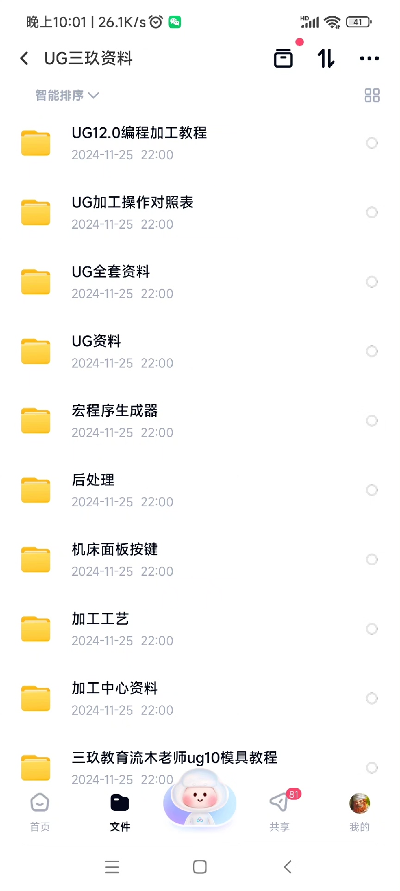
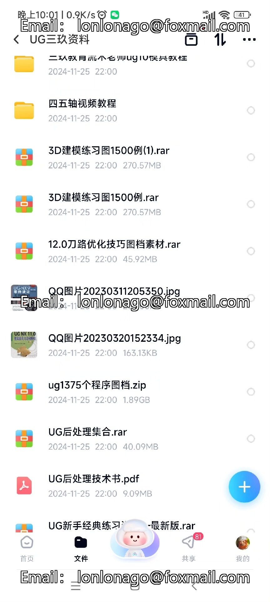
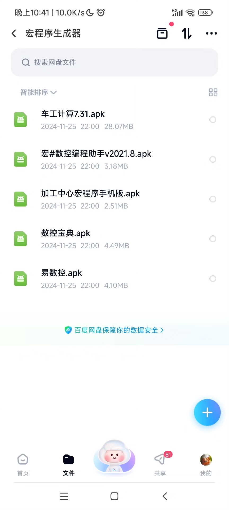
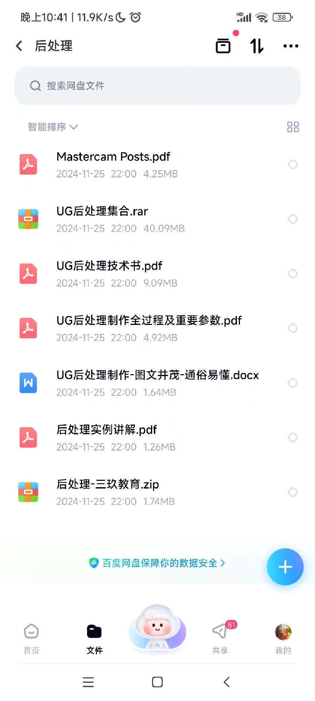
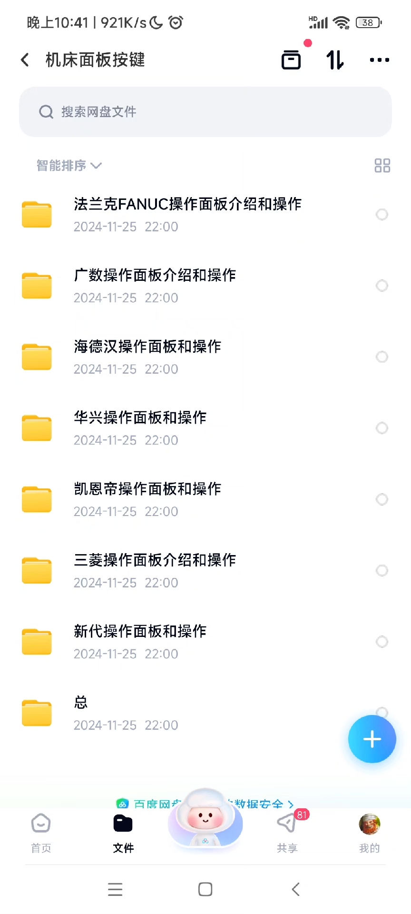
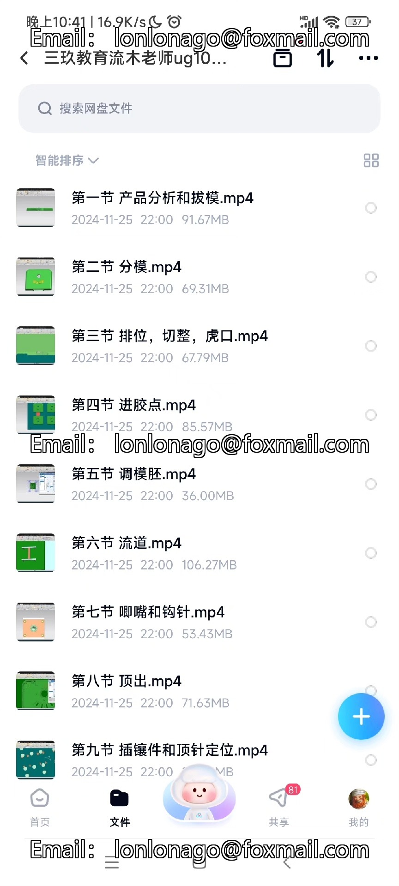
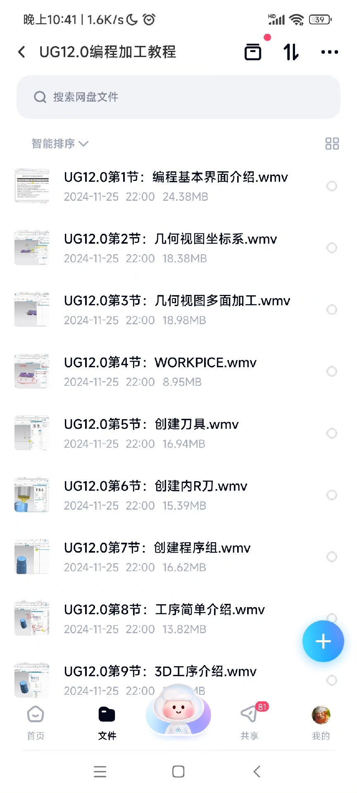
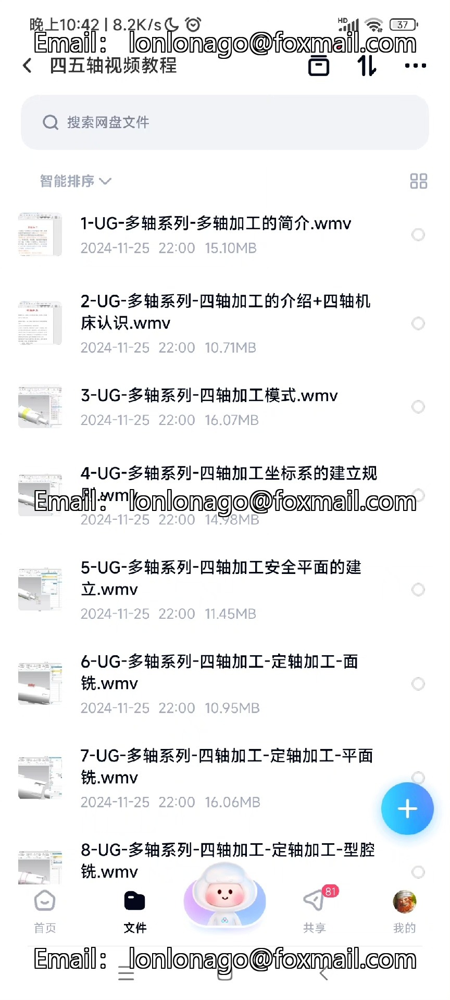
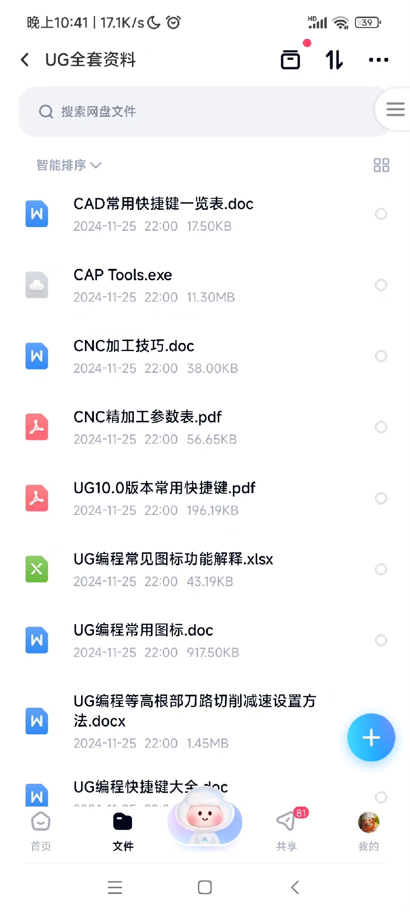

# UG12.0 programming and machining tutorial - four-five axis video course - Teacher 39 Education ug1

## Body

UG12.0 programming and machining tutorials, four-five axis video tutorials, Teacher from 39 Education's UG10 mold tutorials, UG machining operation comparison table
Macro program generator, machine tool panel buttons, processing technology, machining center materials
Chinese version of UG_NX_12 from beginner to mastery, UG post-processing technology book, essential knowledge for machine machining personnel
UG post-processing collection, 12.0 tool path optimization techniques, image files, material for beginners—the latest edition

45-axis CNC, open course case, classic design materials
2306 programming template, template 811 UG12 CNC machining tool path template
CNC parameter encyclopedia, tool machining parameters table, tool rotation and feed table, various tool parameter files
UG handy batch processing, 3-4 post-processing, new external attachments, role files

Nx ug CNC programming and machining tutorials, CNC teaching, CAM courses
Online courses, UG programming (three, four, five-axis programming high-definition video tutorials), the same video package packed with all kinds of videos
UG NX CNC programming tutorials, including complete sets of video tutorials packed and sent
A complete set of video tutorials from zero baseline UG modeling to three, four, and five-axis programming to become a master, a complete set of video tutorials - including supporting images, programming external attachments, post-processing, programming templates, customized roles, processing parameter templates, etc. All in one.
Material is complete, all pictures are included
Send three-four-five-axis special UG post-processing, send four-five-axis practical image files
Send 2306 programming template, send practice image files, send role files
Send processing parameter encyclopedia, premium image files, etc.
DianTu 345-axis matching material courseware

【Disclaimer】
All the files, materials, and materials uploaded by this store come from online public channels, only for learning and exchange use, all copyright belongs to the original authors,
If the copyright owner thinks this store's goods infringe on their rights, please contact the store to inform us, we will handle it as soon as possible and delete it in a timely manner without compensation.
The fee charged by this store is only for the hard work of collecting and organizing, this store does not bear legal responsibility for the copyright issues involved.

## Images

## Payment

Here is a pay link on Stripe ( https://buy.stripe.com/3cs8yP7sY87d0vu9AB ). Please contact me lonlonago@foxmail.com after funding $89, and I will send you a complete data files , thank you!

